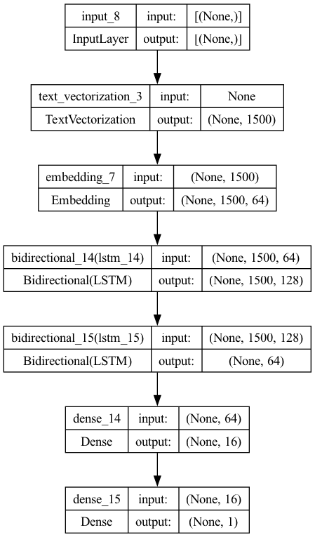

# Ai-content-detector

## Used python interpreter version 3.11.5 (use the same in case of errors)
1.  Install all the required dependencies
2.  Run All the Jupyter Notebook - In either JupyterLab or VSCode
- `python3 lstm_detector.ipynb`
3.  Training dataset example : https://www.kaggle.com/datasets/thedrcat/daigt-v2-train-dataset
- Need to clean/modify the code in case of dataset errors
- Tweak the model training parameters in case you need to according to the dataset
- In my case both classes are balanced
4. Provide text input to the model (in last cell in notebook)
5. Press ENTER with blank to stop the app
6. Achieved Model shown below.

> .
> .
> Model: "Bi-directional_LSTM"
> _________________________________________________________________
>  Layer (type)                            Output Shape              Param #   
> =============================================================================
>  text_vectorization_3 (Text              (None, 1500)              0         
>  Vectorization)                                                  
>                                                                  
>  embedding_7 (Embedding)                 (None, 1500, 64)          3200000   
>                                                                  
>  bidirectional_14 (Bidirectional)        (None, 1500, 128)         66048     
>                                                                  
>  bidirectional_15 (Bidirectional)        (None, 64)                41216     
>                                                                  
>  dense_14 (Dense)                        (None, 16)                1040      
>                                                                  
>  dense_15 (Dense)                        (None, 1)                 17        
>                                                                  
> =============================================================================
> Total params: 3308321 (12.62 MB)
> Trainable params: 3308321 (12.62 MB)
> Non-trainable params: 0 (0.00 Byte)

